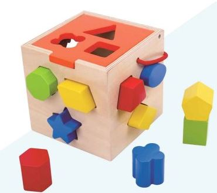

### 변수란 무엇일까
 수학적 의미로 봤을 때 변수는 상수와 대척되는 개념이다. 방정식에서 많이보던 x,y같은 것들이 있다.  
 글자 그대로 변할 수 있는 수라는 뜻인데, 프로그래밍쪽으로 넘어오면 의미가 비슷하면서도 다르다.  
 일단 처음 접했을때 '수'(number)라는 글자 때문에 혼동이 있을 수 있으나 **변수는 숫자만을 의미하는 것이 아닌 여러 데이터를 담을 수 있는 공간이다.**(컴퓨터 데이터가 결국 이진수로 되있다는 면에선 참 맞는 표현일수도..)  
  
### 무얼 담을 수 있는가
 앞서 말했듯 변수는 프로그램 내의 다양한 데이터들을 담을 수 있는 공간이다.(대강의 개념상 그렇다는 것이지, 실재 어떻게 돌아가는지는 차후 메모리를 공부하며 정리해보자.)  

 숫자 말고도 다양한 형태의 데이터가 들어 갈 수 있는데 문자, 참/거짓 등이 있다. 이를 변수 타입(Type)이라고 한다.  
 변수 타입에는 기본(원시, Primitive) 타입과 참조(reference) 타입이 있는데 이에 대해선 조금 뒤에 알아보자.  
  
### 어떻게 쓰는가
 대강 아래의 코드를 보면 기본 타입의 용법은 간단하게 볼 수 있다.
```java
int i = 5; // 정수형 
float f = 5.2f; // 실수형
double dd = 5.2d; // 실수형
double d = 5.2; // double의 경우는 d가 생략 가능하다.
boolean b = true; // 논리형

char c = 'a'; // 문자형
String s = "abcdefg"; // 문자열
```
- 이처럼 변수를 만들고, 값을 넣는 과정을 '선언'이라고 한다.
- 선언문의 문법상 int 5 = i; 처럼 뒤집어 썼을 때는 동작하지 않는다.( = 기준으로 오른쪽이 왼쪽으로 들어간다)
- float과 double 두 실수형은 각각 4byte, 8byte로 저장소의 크기가 다르다.
- float은 숫자 뒤에 f가 붙어야 하지만 double은 d가 생략 가능하다.    
- 문자열 String은 정확히는 기본타입은 아니고 char를 이어 붙여(배열) 쉽게 문자열을 다룰 수 있게 해주는 객체다.

### 맞는 타입만 들어갈 수 있다.
{: .align-center}

{: .align-center}

 앞서 봤듯 변수는 각각의 타입에 맞는 자료들이 들어와야 한다. 오각형 퍼즐을 사각형 구멍에 넣으려면 안들어가는 것 처럼.  
 단 char 타입의 경우 ASCII 코드(자바는 Unicode던가?)에 따라 각 문자에 맞는 숫자가 저장되기 때문에 숫자를 넣어도 돌아는 간다.  


### 변수 이름 짓기 - 코드 네이밍 컨벤션 
 변수명은 숫자로 시작 할 수 없고, 관습적으로 camelCase를 사용하는데, ```시작은 소문자, 띄어쓰기가 발생할 때 대문자로 표기 해주는``` 표기법 을 사용한다.  
 많은 프로그래머들이 중복을 피하고 간결하면서도 명확하게 알 수 있는 변수명을 짓기 위해 많은 고심을 하게되는데..... 이는 **Code Naming Convention**이라고 따로 위키에도 항목이 있다. 

 코드를 혼자 볼거면 모를까 협업 등을 위해 가독성 좋은 이름 붙이기를 알아 놓을 필요도 있을 것이다. 블로그 글도 첨부하니 한번 참고 하면 좋겠다. 

[Code Naming Convention Wiki](https://en.wikipedia.org/wiki/Naming_convention_(programming))  
[코딩에서 이름 짓는 9가지 기본규칙](https://medium.com/wix-engineering/naming-convention-8-basic-rules-for-any-piece-of-code-c4c5f65b0c09)  


### 기타
 자바에서는 double도 있고 Double도 있고, int와 Integer 등 언뜻 같아 보이는게 존재한다.  
 [Stack overflow](https://stackoverflow.com/questions/13332012/double-vs-double-in-java)에서 좋아요를 가장 많이 받은 답변 따르면... ```double에는 null(비어있는 값)이 안들아가고 Double에는 null이 들어간다```...ㅋㅋㅋ  
 맞는 말이긴 한데, 더 중요한 것은 앞서 사용한 double, int는 *기본 타입*이고 Integer, Double등은 *객체*다. 객체는 앞선 포스트에서 보았듯 데이터 뿐만 아니라 이를 처리할 여러 기능을 함께 품고 있다고 볼 수 있다. 이는 String도 마찬가지이다. 
